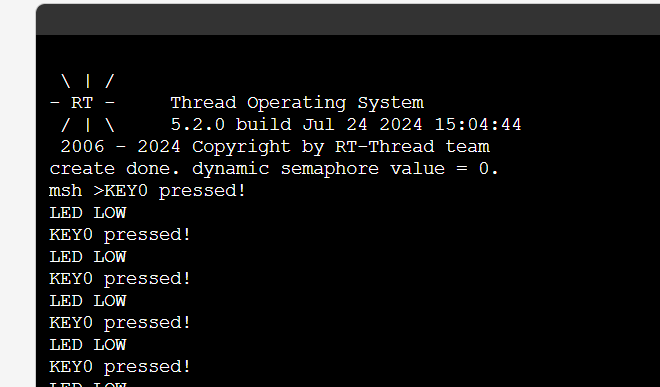

# day3-RT-thread IPC学习

## 1.学习内容

今天主要学习了RT-Thread中的信号量和互斥量，邮箱和消息队列等，这些是操作系统中用于线程同步和互斥控制的重要工具。

### 信号量

信号量是一种用于控制多个线程对共享资源访问的机制。它允许多个线程等待某个条件的发生。

**创建与销毁**：使用`rt_sem_init`和`rt_sem_detach`进行信号量的初始化和销毁。

**等待与释放**：通过`rt_sem_take`和`rt_sem_release`控制对共享资源的访问。`rt_sem_take`会阻塞直到信号量可用，而`rt_sem_release`会增加信号量的计数，从而可能唤醒等待的线程。

### 互斥量

互斥量用于保护代码段，确保同一时间**只有**一个线程可以访问某个资源。

**创建与销毁**：使用`rt_mutex_init`和`rt_mutex_detach`进行互斥量的初始化和销毁。

**锁定与解锁**：通过`rt_mutex_take`和`rt_mutex_release`来锁定和解锁互斥量。锁定互斥量会阻塞其他线程访问受保护的资源，直到互斥量被解锁。

## 2.示例代码
```c

/*
 * Copyright (c) 2023, RT-Thread Development Team
 *
 * SPDX-License-Identifier: Apache-2.0
 *
 * Change Logs:
 * Date           Author       Notes
 * 2023-07-06     Supperthomas first version
 * 2023-12-03     Meco Man     support nano version
 */

#include <board.h>
#include <rtthread.h>
#include <drv_gpio.h>
#ifndef RT_USING_NANO
#include <rtdevice.h>
#endif /* RT_USING_NANO */

#define PIN_KEY0      GET_PIN(C, 0)     // PC0:  KEY0         --> KEY

#define GPIO_LED_B    GET_PIN(F, 11)
#define GPIO_LED_R    GET_PIN(F, 12)

#define THREAD_PRIORITY         25	//线程优先级
#define THREAD_STACK_SIZE       1024	//栈大小
#define THREAD_TIMESLICE        5	//时钟节拍数

static rt_thread_t tid1 = RT_NULL;	//线程1
static rt_thread_t tid2= RT_NULL;	//线程2
static rt_sem_t dynamic_sem = RT_NULL;	//信号量

static void key_name_entry(void *parameter);	//按键线程入口函数
static void led_name_entry(void *parameter);	//led灯线程入口函数

int main(void)
{
    rt_pin_mode(GPIO_LED_R, PIN_MODE_OUTPUT);	//定义led的gpio为输出
    rt_pin_mode(PIN_KEY0, PIN_MODE_INPUT_PULLUP);//定义按键gpio为上拉输入
    rt_pin_write(GPIO_LED_R, PIN_HIGH);	//初始化led为高电平

    dynamic_sem = rt_sem_create("dsem", 0, RT_IPC_FLAG_PRIO);//创建信号量
    if (dynamic_sem == RT_NULL)
    {
        rt_kprintf("create dynamic semaphore failed.\n");
        return -1;
    }
    else
    {
        rt_kprintf("create done. dynamic semaphore value = 0.\n");
    }

	//创建按键线程
    tid1 = rt_thread_create("key_thread",
                            key_name_entry, RT_NULL,
                            THREAD_STACK_SIZE,
                            THREAD_PRIORITY, THREAD_TIMESLICE);
    if (tid1 != RT_NULL)
	//如果创建线程成功则启动线程
        rt_thread_startup(tid1);

	//创建led灯线程
    tid2 = rt_thread_create("led_thread",
                            led_name_entry, RT_NULL,
                            THREAD_STACK_SIZE,
                            THREAD_PRIORITY, THREAD_TIMESLICE);
    if (tid2 != RT_NULL)
	//如果创建线程成功则启动线程
        rt_thread_startup(tid2);
}

//按键线程入口函数
static void key_name_entry(void *parameter)
{
    rt_uint32_t count = 0;

    while (1)
    {
        if (rt_pin_read(PIN_KEY0) == PIN_LOW)//简单的按键检测
        {
            rt_thread_mdelay(100);
            if (rt_pin_read(PIN_KEY0) == PIN_LOW)
            {
                rt_kprintf("KEY0 pressed!\r\n");//打印信息
                rt_sem_release(dynamic_sem);	//释放信号量
            }
        }
        rt_thread_mdelay(10);
    }
}
//led线程入口函数
static void led_name_entry(void *parameter)
{
    rt_uint32_t result = 0;
    while (1)
    {	
	//以RT_WAITING_FOREVER状态等待信号量
        result = rt_sem_take(dynamic_sem, RT_WAITING_FOREVER);
        if (result == RT_EOK)	//得到信号量
        {
            rt_kprintf("LED LOW\r\n");
            rt_pin_write(GPIO_LED_R, PIN_LOW);	//led灯亮
        }
        else
        {
            rt_kprintf("LED HIGH\r\n");
            rt_pin_write(GPIO_LED_R, PIN_HIGH);
        }
    }
}

```
我来讲一下我自己的理解，这个程序就是一个简单的按键点灯程序，而且有bug点亮之后只能通过重启熄灭。不过也无伤大雅，用来理解信号量也是绰绰有余。

我个人理解，信号量有点类似标志位的概念。当按键线程中按键被触发，释放一个信号，同时一直阻塞的led线程收到该信号，开始执行逻辑。在本例程里就信号量就类似开关的作用，一个释放一个接收。之所以灯会一直亮是因为，信号量被释放后没有被销毁导致的。

### 示例结果

还有就是从env上下载线上的一些示例代码。

配置软件包

下载在线软件包

编译

烧录后打开msh命令后可以看到

将命令导入msh控制台


